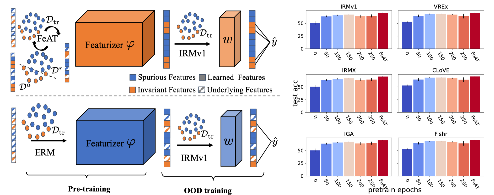

<h1 align="center">FeAT: Feature Augmented Training</h1>
<p align="center">
    <a href="https://arxiv.org/abs/2304.11327"></a>
    <a href="https://github.com/LFhase/FeAT"></a>
    <!-- <a href=""></a> -->
    <a href="https://openreview.net/forum?id=eozEoAtjG8">  </a>
    <a href="https://github.com/LFhase/PAIR/blob/main/LICENSE">  </a>
    <a href="https://nips.cc/virtual/2023/poster/70939"> </a>
    <a href="https://lfhase.win/files/slides/FeAT.pdf"> </a>
   <!--  <a href="https://icml.cc/media/PosterPDFs/ICML%202022/a8acc28734d4fe90ea24353d901ae678.png"> </a> -->
</p>

This repo contains the sample code for reproducing the results of our NeurIPS 2023: *[Understanding and Improving Feature Learning for Out-of-Distribution Generalization](https://arxiv.org/abs/2304.11327)*, which has also been presented as ***spotlight*** at [ICLR DG](https://domaingen.github.io/), and at [ICML SCIS](https://sites.google.com/view/scis-workshop/home) Workshop. 😆😆😆

Updates:

- [x] If you feel hard to tune even the last layer, why not try with our optimizer [PAIR](https://github.com/LFhase/PAIR) for OOD objectives! 😆😆😆
- [x] Camera-ready version of the paper is updated [link](https://arxiv.org/abs/2304.11327)!
- [x] Detailed running instructions, slides and the recording have been released!

## What feature does ERM learn for generalization?
Empirical risk minimization (ERM) is the *de facto* objective adopted in Machine Learning and obtains impressive generalization performance. Nevertheless, ERM is shown to be prone to spurious correlations, and is suspected to learn predictive but **<ins>spurious</ins>** features for minimizing the empirical risk.
However, recently [Rosenfeld et al., 2022](https://arxiv.org/abs/2202.06856);[Kirichenko et al., 2022](https://arxiv.org/abs/2204.02937) empirically show that ERM already learn **<ins>invariant features</ins>** that hold an invariant relation with the label for in-distribution and Out-of-Distribution (OOD) generalization.

<p align="center"></p>

We resolve the puzzle by theoretically proving that ERM essentially learns both **<ins>spurious and invariant features</ins>**. 
Meanwhile, we also find OOD objectives such as IRMv1 can **<ins>hardly learn new features</ins>** even at the begining of the optimization.
Therefore, when optimizing OOD objectives such as IRMv1, pre-training the model with ERM is usually necessary for satisfactory performance. 
As shown in the right subfigure, the OOD performance of various OOD objective first grows with more ERM pre-training epochs. 

However, **<ins>ERM has its preference to learning features</ins>** depending on the inductive biases of the dataset and the architecture. The limited feature learning can pose a bottleneck for OOD generalization. Therefore, we propose Feature Augmented Training (FeAT), that aims to learn all features so long as they are useful for generalization. Iteratively, FeAT divides the training data $\mathcal{D}_{tr}$ into **<ins>augmentation sets</ins>** $D^a$ where the features not sufficiently well learned by the model, and the **<ins>retention sets</ins>** $D^r$ that contain features already learned by the current model at the round. Learning on the partitioned datasets with FeAT augments the model with new features contained in the growing augmentation sets while retaining the already learned features contained in the retention sets, which will lead the model to learn **<ins>richer features</ins>** for OOD training and obtain a better OOD performance.

For more interesting stories of rich feature learning, please read more into the repositories [Bonsai](https://github.com/TjuJianyu/RFC), [RRL](https://github.com/TjuJianyu/RRL) and the [blog](https://www.jianyuzhang.com/blog/rich-representation-learning) by [Jianyu](https://www.jianyuzhang.com/home). 😆


## Structure of Codebase

The whole code base contain four parts, corresponding to experiments presented in the paper:

- `ColoredMNIST`: Proof of Concept on ColoredMNIST
- `WILDS`: Verification of FeAT in WILDS


### Dependencies
We are running with cuda=10.2 and python=3.8.12 with the following key libraries:
```
wilds==2.0.0
torch==1.9.0
```

## ColoredMNIST

The corresponding code is in the folder [ColoredMNIST](./ColoredMNIST).
The code is modified from [RFC](https://github.com/TjuJianyu/RFC/).

To reproduce results of FeAT, simply run the following commands under the directory:

Step 1. Pretraining the featurizer with FeAT


For the original ColoredMNIST data (CMNIST-25):

```
rounds=2
ifeat_resdir=coloredmnist025_ifeat_r${rounds}

python run_exp.py --verbose True --steps 0 --freeze_featurizer True --dataset coloredmnist025 --eval_steps 1  --methods ifeat --rounds ${rounds} --save_dir ${ifeat_resdir}
```

For the modified ColoredMNIST data (CMNIST-01):

```
rounds=3
ifeat_resdir=coloredmnist01_ifeat_r${rounds}

python run_exp.py --verbose True --steps 0 --freeze_featurizer True --dataset coloredmnist01 --eval_steps 1  --methods ifeat --rounds ${rounds} --save_dir ${ifeat_resdir}
``` 

The trained weights will be saved to `ifeat_resdir` specified before running.
The second step will load the weights and freeze the featurizer (by default) to train the new classifier.

Step 2. Training a new classifier with various OOD objectives:

```

# for coloredmnist025
python run_exp.py  --methods irm  --verbose True --freeze_featurizer True --penalty_anneal_iters 0 --dataset coloredmnist025 --n_restarts 10 -p 1e4 --load_model_dir ${ifeat_resdir} -nt --steps 2001

# for coloredmnist01
python run_exp.py  --methods vrex  --verbose True --freeze_featurizer True --penalty_anneal_iters 0 --dataset coloredmnist01 --n_restarts 10 -p 1e6 --load_model_dir ${ifeat_resdir} -nt --steps 5001
```

Here `-nt` means we will train a new classifier. One could also use the original classifier for the second step.

Or you could execute the two steps one way together:
```
# for coloredmnist025
python run_exp.py --verbose True --steps 501  -p 1e4 --freeze_featurizer True --dataset coloredmnist025 --eval_steps 1  --methods ifeat --rounds 2 --penalty_anneal_iters 0 --stage2_methods irm

# for coloredmnist01
python run_exp.py --verbose True --steps 501  -p 1e6 --freeze_featurizer True --dataset coloredmnist01 --eval_steps 1  --methods ifeat --rounds 3 --penalty_anneal_iters 0 --stage2_methods vrex
```
where:

- `--steps`: indicates how many steps the OOD training should perform;
- `-p`: indicates the penalty weights for the OOD objectives;
- `--methods`: indicates what feature learning algorithms needs to be used;
- `--rounds`: indicates the maximum number rounds (if applicable) the feature learning algorithm will use;
- `--penalty_anneal_iters`: indicates the number of pretraining steps with a small OOD penalty before the OOD training. It will be set to 0 by default when using a feature learning algorithm;
- `--stage2_methods`: indicates what OOD objective will be used in the second stage when perform both steps together;


## WILDS

The corresponding code is in the folder [WILDS](./WILDS).
The code is modified from [PAIR](https://github.com/LFhase/PAIR) and [spurious-feature-learning](https://github.com/izmailovpavel/spurious_feature_learning).


To run with wilds codes,
for example,

Step 1. Pretraining the featurizer with FeAT:
```
data_dir=#YOUR DIRECTORY FOR WILDS DATA
exp_dir=#YOUR DIRECTORY FOR EXPERIMENT RECORDS
dataset=#YOUR DATASET

python feat_run.py --data-dir ${data_dir} --exp-dir ${exp_dir} --dataset ${dataset} -ifeat --epochs 10 -pi ${pretrain_iters} --seed 0 -pr ${pretrain_rounds} -rp ${retain_penalty} --frozen --algorithm ${OOD_algorithm_second_stage} 
```
Similarly, the trained model weights will be saved, and are ready to be used to train other OOD algorithms.

Step 2. Training a new classifier with various OOD objectives:

```
data_dir=#YOUR DIRECTORY FOR WILDS DATA
exp_dir=#YOUR DIRECTORY FOR EXPERIMENT RECORDS
dataset=#YOUR DATASET

python feat_run.py --data-dir ${data_dir} --exp-dir ${exp_dir} --dataset ${dataset} -ifeat --epochs 10 -pi ${pretrain_iters} --seed 0 -pr ${pretrain_rounds} -rp ${retain_penalty} --frozen --algorithm ${OOD_algorithm_second_stage}  
```

We add additional commands to control the training:

- `-pc`: whether to use the pretrained classifier;
- `-use_old`: use the already trained model weights with the same hyperparameter settings;

The running scripts fow wilds experiments can be found [here](./WILDS/scripts).

Additional Step. Using DFR to evaluate the feature learning quality:

```
python feat_dfr_run.py --data_dir=${data_path} \
                    --data_transform=${data_transformation} \
                    --dataset=${dataset}  --model=${backbone} \
                    -feat -cheat --seed ${seed}  \
                    --ckpt_path=${checkpoint_from_step1}
```

- `-cheat`: use a cheat evaluation protocal;
- `-feat`: indicates it's the model trained by FeAT;
- `--predict_spurious`: indicates to evaluate the spurious feature learning;

The running scripts fow DFR evaluation experiments can be found [here](./WILDS/scripts/feat_dfr.sh).


## Tips
- If you feel hard to tune even the last layer, why not try with our optimizer [PAIR](https://github.com/LFhase/PAIR) for OOD objectives! 😆😆😆

## Misc

If you find our paper and repo useful, please cite our paper:

```bibtex
@inproceedings{
    chen2023understanding,
    title={Understanding and Improving Feature Learning for Out-of-Distribution Generalization},
    author={Yongqiang Chen and Wei Huang and Kaiwen Zhou and Yatao Bian and Bo Han and James Cheng},
    booktitle={Thirty-seventh Conference on Neural Information Processing Systems},
    year={2023},
    url={https://openreview.net/forum?id=eozEoAtjG8}
}
```
